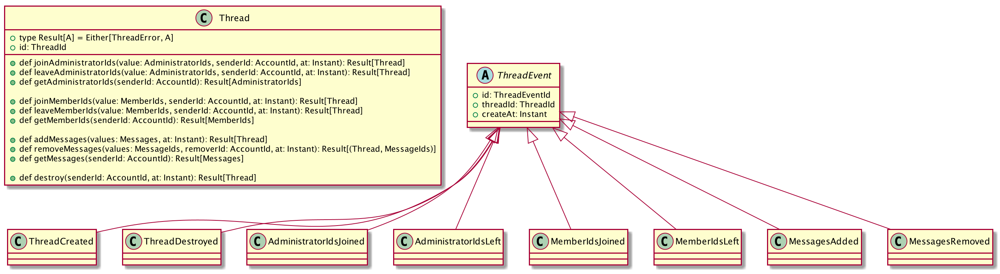

class: animation-fade impact

.top-bar[

]
.bottom-bar[
  ScalaMatsuri 2019
]

# AWS EKSとAkkaを使って
# EventnSourcingを作るにはどうしたらよいか

ScalaMatsuri 2019

かとじゅん(@j5ik2o)

.center[]

---
title: AWS EKSとAkkaを使ってEvent Sourcingを作るにはどうしたらよいか
class: animation-fade
layout: true

<!-- This slide will serve as the base layout for all your slides -->

.top-bar[
  {{title}}
]
.bottom-bar[
  ScalaMatsuri 2019
]

---

# 自己紹介

.col-6[
- Chatwork テックリード
- github/j5ik2o
    - [scala-ddd-base](https://github.com/j5ik2o/scala-ddd-base)
    - [scala-ddd-base-akka-http.g8](https://github.com/j5ik2o/scala-ddd-base-akka-http.g8)
    - [reactive-redis](https://github.com/j5ik2o/reactive-redis)
    - [reactive-memcached](https://github.com/j5ik2o/reactive-memcached)
- 翻訳レビュー
    - [エリックエヴァンスのドメイン駆動設計](https://amzn.to/2PmEHuU)
    - [Akka実践バイブル](https://amzn.to/2Qx54uU)
]

.col-6[
.center[]
]

---

# アジェンダ

1. AkkaでのEvent Sourcing
2. EKS環境の構築とデプロイ

---
class: impact

# AkkaでのEvent Sourcing

---

# Event Sourcingとは

- イベントがあれば現在の状態がわかる
- 取引もイベントソーシング。モデルとして特別なものではない
- イベントはイミュータブルな歴史を表現している
  - 訂正は赤黒訂正(通常伝票は黒インク/訂正は赤インクから由来)
    - 700番で0001番の受注と取り消し、伝票番号701番で修正後のデータを登録している
  - gitもイベントソーシング。打ち消しはrevertコミットを追加する
  
.center[]

---

# ドメインイベントとは

.col-6[
- 過去にに発生した出来事のこと=イベント
- ドメインエキスパートが関心を持つイベント=ドメインイベント
- 一般的には過去形の動詞で表現される
  - CustomerRelocated
  - CargoShipped
]
.col-6[
- イベントとコマンドは似ているが、人間が扱う言語としては別モノ
  - コマンドは拒否されることがある
  - イベントは既に起こったことを示す
]  
.center[]

---
class: impact

# Event Sourcingシステムを作る
# 簡易的なチャットアプリケーション

---

# システム要件

- HTTPサーバでコマンドとクエリを受け付ける
- チャットを開始するときは、スレッドを作成する
- スレッドへの投稿はメンバーのみ可能
- スレッドへ投稿するメッセージはテキストのみとする
- 便宜上、認証・認可は省略する

---

# APIサーバのシステム構成図

.col-6[
.center[]
]

.col-6[
- コマンドとクエリを分割する
- コマンドは、クラスターシャーディングされた集約アクターへ送信される
- 集約アクターはコマンドを受け付けるとドメインイベントをストレージに追記保存する
- クラスターシャーディングされたRMUは集約アクターと連動して起動し、起動直後に担当する集約IDのドメインイベントを読み込みSQLを実行しリードモデルを作成する
- クエリは、DAOを使ってリードモデルを読み込んで返す
- k8sのPodとしてデプロイする
]

---

# ドメインモデル

.col-6[
- Account
    - 本システムの利用者を識別するアカウント情報
- Thread
    - Messageを交換するための場を示す
- Message
    - 何らかの言語で表現された伝言
]
.col-6[
- Administrator
    - 当該Threadの管理者
- Member
    - 当該Threadの利用者
]
.center[]

---

# ドメインイベント

ThreadEventのサブ型

- ThreadCreated
- ThreadDestroyed
- AdministratorIdsJoined
- AdministratorIdsLeft
- MemberIdsJoined
- MemberIdsLeft
- MessagesAdded 
- MessagesRemoved

---

# レイヤー構成

.col-6[
- クリーンアーキテクチャ
- 共通 
    - interface-adaptor
    - infrastructure
- コマンド側
    - use-case
    - domain
- クエリ側
    - data access stream
    - data access object
] 
.col-6[
.center[]
]

---

# Kubernetes/EKSを学ぶ

- [Kubernetes公式サイト](https://kubernetes.io/ja/docs/home/)
- [Amazon EKS](https://docs.aws.amazon.com/ja_jp/eks/latest/userguide/what-is-eks.html)
- [Amazon EKS Workshop](https://eksworkshop.com/)

---

# まとめ

- ドメインイベントは、ドメインの分析と実装の両方で使えるツール
- 集約を跨がる整合性の問題は難しいが、解決方法がないわけではない

---
class: impact

# 一緒に働くエンジニアを募集しています！

## http://corp.chatwork.com/ja/recruit/

.center[]
