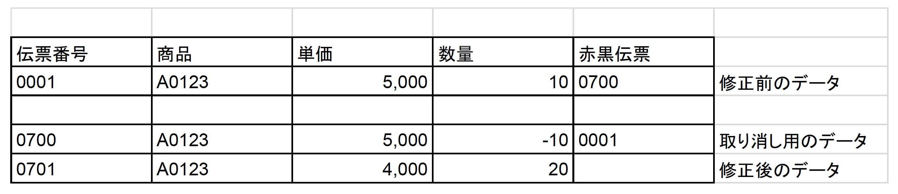

class: animation-fade impact

.top-bar[

]
.bottom-bar[
  ScalaMatsuri 2019
]

# How to build an Event-Sourcing system Ho
# using Akka with EKS

ScalaMatsuri 2019

Junichi Kato(@j5ik2o)

.center[]

---
title: How to build an Event-Sourcing system using Akka with EKS
class: animation-fade
layout: true

<!-- This slide will serve as the base layout for all your slides -->

.top-bar[
  {{title}}
]
.bottom-bar[
  ScalaMatsuri 2019
]

---

# Who am I

.col-6[
- Chatwork Tech-Lead
- github/j5ik2o
    - [scala-ddd-base](https://github.com/j5ik2o/scala-ddd-base)
    - [scala-ddd-base-akka-http.g8](https://github.com/j5ik2o/scala-ddd-base-akka-http.g8)
    - [reactive-redis](https://github.com/j5ik2o/reactive-redis)
    - [reactive-memcached](https://github.com/j5ik2o/reactive-memcached)
- 翻訳レビュー
    - [エリックエヴァンスのドメイン駆動設計](https://amzn.to/2PmEHuU)
    - [Akka実践バイブル](https://amzn.to/2Qx54uU)
]

.col-6[
.center[]
]

---

# Agenda

1. Event Sourcing with Akka
2. Deployment to EKS

.bottom-bar[
Akka
]

---
class: impact

# Akka with Event Sourcing

---

# Event Sourcing

- The latest state is derived by the events
- For example, transactions such as the e-commerce are sourced on events. This is nothing special.
- An event sequence represents an immutable history.
  - The transaction makes the following unique corrections. Events are never modified or deleted.
    - The order #0001 is canceled at the #0700, and the corrected data is registered at the slip #0701.
  
.center[]


---

# Domain Events

.col-6[
- Events that occurred in the past
- Domain Events are events that a domain expert is interested in
- Generally, Domain Events is expressed as a verb in past tense
  - CustomerRelocated
  - CargoShipped
]
.col-6[
- Events and commands are similar, but different languages ​​are handled by humans
  - Command may be rejected
  - Indicates that the event has already occurred
]  
.center[]

---
class: impact

# Consider thread-weaver 
# as an example of a simple chat application.

---

# System requirements

- API server accepts commands and queries from API clients
- Create a thread to start the chat
- Only members can post to threads
- Only text messages posted to threads
- Omit authentication and authorization for convenience
---

# System Configuration

.col-6[
.center[]
]

.col-6[
- Split commands and queries
- The command is sent to (clustered sharding) aggregate actor
- The aggregate actor appends and stores domain events in storage when it accepts a command
- RMU(cluster sharding ) starts up in conjunction with the aggregation actor and reads the domain events for the appropriate aggregate ID immediately after startup, executes the SQL, and creates the Read-Model
- Query uses DAO to load and return the lead model
- Deploy the api-server as a kubernetes pod
]

---

class: impact

# Command side


---

# Domain Objects

.col-6[
- Account
    - Account information identifying the user of the system
- Thread
    - Indicates a place to exchange Messages
- Message
    - A story written in some language言
]
.col-6[
- Administrator
  - Administrator of the Thread
- Member
  - Users of the Thread
]
.center[]

---

# Domain Events

ThreadEvent sub types

- Create/Destroy Thread
    - ThreadCreated
    - ThreadDestroyed
- Join/Leave AdministratorIds
    - AdministratorIdsJoined
    - AdministratorIdsLeft
- Join/Leave MemberIds
    - MemberIdsJoined
    - MemberIdsLeft
- Add/Remove Messages
    - MessagesAdded 
    - MessagesRemoved

---

# Layered architecture

.col-6[
- Clean Architecture
- Common
    - interface-adaptors
    - infrastructure
- Command side
    - use-cases
    - domain
- Query side
    - data access streams
    - data access objects
] 
.col-6[
.center[]
]

---

# Projects structure

.center[
<object type="image/svg+xml" data="images/modules.svg" width="900"></object>
]

---

# Domain objects with actors

.col-8[
.center[
<object type="image/svg+xml" data="images/actor-tree.svg" ></object>
]
]
.col-4[
- Actors that fulfill all the functions are undesirable
- Follow object-oriented principles to build a hierarchy of actors with a single responsibility
]

---

# Thread

```scala
trait Thread {

  def isAdministratorId(accountId: AccountId): Boolean
  def isMemberId(accountId: AccountId): Boolean

  def joinAdministratorIds(value: AdministratorIds, senderId: AccountId, at: Instant): Result[Thread]
  def leaveAdministratorIds(value: AdministratorIds, senderId: AccountId, at: Instant): Result[Thread]
  def getAdministratorIds(senderId: AccountId): Result[AdministratorIds]

  def joinMemberIds(value: MemberIds, senderId: AccountId, at: Instant): Result[Thread]
  def leaveMemberIds(value: MemberIds, senderId: AccountId, at: Instant): Result[Thread]
  def getMemberIds(senderId: AccountId): Result[MemberIds]

  def addMessages(values: Messages, at: Instant): Result[Thread]
  def removeMessages(values: MessageIds, removerId: AccountId, at: Instant): Result[(Thread, MessageIds)]
  def getMessages(senderId: AccountId): Result[Messages]

  def destroy(senderId: AccountId, at: Instant): Result[Thread]
}
```
.bottom-bar[
Threadモデルをアクターの状態として扱う 
]
---

# ThreadAggregate

.col-6[
```scala
class ThreadAggregate(id: ThreadId,
  subscribers: Seq[ActorRef]) extends Actor {
  // add messages handler
  private def commandAddMessages(thread: Thread): Receive = {
    case AddMessages(requestId, threadId,
      messages, createAt, reply) if threadId == id =>
      thread.addMessages(messages, createAt) match {
        case Left(exception) =>
          if (reply)
            sender() ! AddMessagesFailed(ULID(), requestId,
              threadId, exception.getMessage, createAt)
        case Right(newThread) =>
          if (reply)
            sender() ! AddMessagesSucceeded(ULID(), requestId,
              threadId, messages.toMessageIds, createAt)
          context.become(onCreated(newThread))
      }
  }
  
  override def receive: Receive = { /*...*/ }
}
```
]
.col-6[
- Actors that support transactional integrity
- The boundary of the data update is the same as the boundary the aggregates has.
- For example, when an actor receives the CreateThead command, a Thread state is generated internally
- Then Messages are also added to the Thread when the AddMessages command is receives
- If the other commands defined in the protocol are received by the Actor, the Actor will have corresponding side effects.
]

---

# ThreadAggreateSpec

.col-6[
```scala
val threadId        = ThreadId()
val threadRef       = newThreadRef(threadId)
val now             = Instant.now
val administratorId = AccountId()
val title           = ThreadTitle("test")

threadRef ! CreateThread(ULID(), threadId, administratorId, 
  None, title, None, AdministratorIds(administratorId),
  MemberIds.empty, now, reply = false)
      
val messages = Messages(TextMessage(MessageId(), None, 
  ToAccountIds.empty, Text("ABC"), memberId, now, now))
threadRef ! AddMessages(ULID(), threadId, messages, 
  now, reply = true)

expectMsgType[AddMessagesResponse] match {
 case f: AddMessagesFailed =>
   fail(f.message)
 case s: AddMessagesSucceeded =>
   s.threadId shouldBe threadId
   s.createAt shouldBe now
}
```
]
.col-6[
- 
]

---

# PersistentThreadAggregate(1/2)

.col-6[
```scala
object PersistentThreadAggregate {
  def props(id: ThreadId, subscribers: Seq[ActorRef]): Props =
      ...
}

class PersistentThreadAggregate(id: ThreadId, 
  subscribers: Seq[ActorRef], 
  propsF: (ThreadId, Seq[ActorRef]) => Props)
    extends PersistentActor with ActorLogging {

  override def supervisorStrategy: SupervisorStrategy = 
    OneForOneStrategy() { case _: Throwable => Stop }

  private val childRef =
    context.actorOf(propsF(id, subscribers), 
      name = ThreadAggregate.name(id))
  context.watch(childRef)

  override def persistenceId: String = ThreadAggregate.name(id)

  override def receiveRecover: Receive = {
    case e: ThreadCommonProtocol.Event with ToCommandRequest =>
      childRef ! e.toCommandRequest
    case RecoveryCompleted =>
      log.debug("recovery completed")
  }
```
]
.col-6[
- Actors that add persistence to ThreadAggregate
- Domain behavior is provided by child actors
- The recover process sends commands generated from events to child actors.
]

---

# PersistentThreadAggregate(2/2)

.col-6[
```scala
  override def receiveCommand: Receive = {
    case Terminated(c) if c == childRef =>
      context.stop(self)
    case m: CommandRequest with ToEvent =>
      childRef ! m
      context.become(sending(sender(), m.toEvent))
    case m =>
      childRef forward m
  }
  
  private def sending(replyTo: ActorRef, 
    event: ThreadCommonProtocol.Event): Receive = {
    case s: CommandSuccessResponse => persist(event) { _ =>
        replyTo ! s
        unstashAll()
        context.unbecome()
      }
    case f: CommandFailureResponse =>
      replyTo ! f
      unstashAll()
      context.unbecome()
    case _ =>
      stash()
  }
}
```
]

.col-6[
- Delegate to child actors when receiving commands. Persists only on success
- message processing is suspended until a command response is returned
]

---

# Replaying PersitentThreadAggregate

.col-8[
```scala
threadRef1 ! CreateThread(ULID(), threadId, administratorId, None, title, None, 
  AdministratorIds(administratorId), MemberIds.empty, now, reply = false)
val messages = Messages(TextMessage(MessageId(), None, 
  ToAccountIds.empty, Text("ABC"), memberId, now, now))
threadRef1 ! AddMessages(ULID(), threadId, messages, now, reply = false)

//Stop the actorる
killActors(threadRef)

// Recovery
val threadRef2 = system.actorOf(PersistentThreadAggregate.props(threadId, Seq.empty))

// Check if it is in the previous state
threadRef2 ! GetMessages(ULID(), threadId, memberId, now)
expectMsgType[GetMessagesResponse] match {
  case f: GetMessagesFailed =4
    fail(f.message)
  case s: GetMessagesSucceeded =>
    s.threadId shouldBe threadId
    s.createAt shouldBe now
    s.messages shouldBe messages
}
```
]
.col-4[
- a test that intentionally stops and restarts the persistence actor
- Replayed state after reboot
]
---

# ChildActorLookup
.col-8[
```scala
trait ChildActorLookup extends ActorLogging { this: Actor =>
  implicit def context: ActorContext
  type ID
  type CommandRequest

  protected def childName(childId: ID): String
  protected def childProps(childId: ID): Props
  protected def toChildId(commandRequest: CommandRequest): ID

  protected def forwardToActor: Actor.Receive = {
    case _cmd =>
      val cmd = _cmd.asInstanceOf[CommandRequest]
      context
        .child(childName(toChildId(cmd)))
        .fold(createAndForward(cmd, toChildId(cmd)))(forwardCommand(cmd))
  }

  protected def forwardCommand(cmd: CommandRequest)(childRef: ActorRef): Unit =
    childRef forward cmd

  protected def createAndForward(cmd: CommandRequest, childId: ID): Unit = 
    createActor(childId) forward cmd

  protected def createActor(childId: ID): ActorRef =
    context.actorOf(childProps(childId), childName(childId))
}
```
]
.col-4[
- Create a child actor if none exists and forward the message
- forward the message to its child actors, if any
]
---

# ThreadAggregates(Message Broker)

```scala
object ThreadAggregates {

  val name = "threads"

  def props(subscribers: Seq[ActorRef], propsF: (ThreadId, Seq[ActorRef]) => Props): Props =
    Props(new ThreadAggregates(subscribers, propsF))

}

class ThreadAggregates(subscribers: Seq[ActorRef], propsF: (ThreadId, Seq[ActorRef]) => Props)
    extends Actor
    with ActorLogging
    with ChildActorLookup {
  override def receive: Receive = forwardToActor

  override type ID             = ThreadId
  override type CommandRequest = ThreadProtocol.CommandMessage

  override protected def childName(childId: ThreadId): String = childId.value.asString

  override protected def childProps(childId: ThreadId): Props = propsF(childId, subscribers)

  override protected def toChildId(commandRequest: ThreadProtocol.CommandMessage): ThreadId = commandRequest.threadId
}
```

---

# ShardedThreadAggregates (1/2)

.col-6[
```scala
object ShardedThreadAggregates {

  def props(subscribers: Seq[ActorRef], propsF: (ThreadId, Seq[ActorRef]) => Props): Props =
    Props(new ShardedThreadAggregates(subscribers, propsF))

  def name(id: ThreadId): String = id.value.asString

  val shardName = "threads"

  case object StopThread

　// function to extract an entity id
  val extractEntityId: ShardRegion.ExtractEntityId = {
    case cmd: CommandRequest => (cmd.threadId.value.asString, cmd)
  }

  // function to extract a shard id
  val extractShardId: ShardRegion.ExtractShardId = {
    case cmd: CommandRequest =>
      val mostSignificantBits  = cmd.threadId.value.mostSignificantBits  % 12
      val leastSignificantBits = cmd.threadId.value.leastSignificantBits % 12
      s"$mostSignificantBits:$leastSignificantBits"
  }

}
```
]
.col-6[
- Allow ThreadAggregates to be distributed across a cluster
- extractEntityId is the function to extract an entity id
- extractShardId is the function to extract a shard id
]
---

# ShardedThreadAggregates (2/2)

.col-6[
```scala
class ShardedThreadAggregates(subscribers: Seq[ActorRef], 
  propsF: (ThreadId, Seq[ActorRef]) => Props)
    extends ThreadAggregates(subscribers, propsF) {
  context.setReceiveTimeout(Settings(context.system).passivateTimeout)

  override def unhandled(message: Any): Unit = message match {
    case ReceiveTimeout =>
      log.debug("ReceiveTimeout")
      context.parent ! Passivate(stopMessage = StopThread)
    case StopThread =>
      log.debug("StopWallet")
      context.stop(self)
  }
}
```
]
.col-6[
- Inherit ThreadAggregates
- Then add an implementation to passivate ShardedThreadAggregates when occurred ReceiveTimeout 
]

---

# ShardedThreadAggregatesRegion

.col-6[
```scala
object ShardedThreadAggregatesRegion {

  def startClusterSharding(subscribers: Seq[ActorRef])
    (implicit system: ActorSystem): ActorRef =
    ClusterSharding(system).start(
      ShardedThreadAggregates.shardName,
      ShardedThreadAggregates.props(subscribers, 
        PersistentThreadAggregate.props),
      ClusterShardingSettings(system),
      ShardedThreadAggregates.extractEntityId,
      ShardedThreadAggregates.extractShardId
    )

  def shardRegion(implicit system: ActorSystem): ActorRef =
    ClusterSharding(system)
      .shardRegion(ShardedThreadAggregates.shardName)
}
```
]
.col-6[
- The startClusterSharing method will start ClusterSharing with the specified settings
- The shardRegion method gets the ActorRef to the started ShardRegion.
]
---

# MultiJVM Testing

```scala
    "setup shared journal" in {
      Persistence(system)
      runOn(controller) { system.actorOf(Props[SharedLeveldbStore], "store") }
      enterBarrier("persistence-started")
      runOn(node1, node2) {
        system.actorSelection(node(controller) / "user" / "store") ! Identify(None)
        val sharedStore = expectMsgType[ActorIdentity].ref.get
        SharedLeveldbJournal.setStore(sharedStore, system)
      }
      enterBarrier("after-1")
    }
    "join cluster" in within(15 seconds) {
      join(node1, node1) { ShardedThreadAggregatesRegion.startClusterSharding(Seq.empty) }
      join(node2, node1) { ShardedThreadAggregatesRegion.startClusterSharding(Seq.empty) }
      enterBarrier("after-2")
    }
    "createThread" in { runOn(node1) {
        val accountId = AccountId(); val threadId  = ThreadId(); val title = ThreadTitle("test")
        val threadRef = ShardedThreadAggregatesRegion.shardRegion
        threadRef ! CreateThread(ULID(), threadId, accountId, None, title, None, AdministratorIds(accountId), 
          MemberIds.empty, Instant.now, reply = true)
        expectMsgType[CreateThreadSucceeded](10 seconds).threadId shouldBe threadId
      }
      enterBarrier("after-3")
    }
```

---

# cluster-sharding with persistence

.col-8[
.center[
<object type="image/svg+xml" data="images/akka-event-sourcing.svg" height="500"></object>
]
]
.col-4[
- 状態をオンメモリに保持したアクターはクラスター上に分散されます
- 発生したドメインイベントは、集約ID毎にパーティショニングされたストレージに追記保存されていきます
]


---

# Kubernetes/EKSを学ぶ

- [Kubernetes公式サイト](https://kubernetes.io/ja/docs/home/)
- [Amazon EKS](https://docs.aws.amazon.com/ja_jp/eks/latest/userguide/what-is-eks.html)
- [Amazon EKS Workshop](https://eksworkshop.com/)


---

# まとめ

- ドメインイベントは、ドメインの分析と実装の両方で使えるツール
- 集約を跨がる整合性の問題は難しいが、解決方法がないわけではない

---
class: impact

# 一緒に働くエンジニアを募集しています！

## http://corp.chatwork.com/ja/recruit/

.center[]
