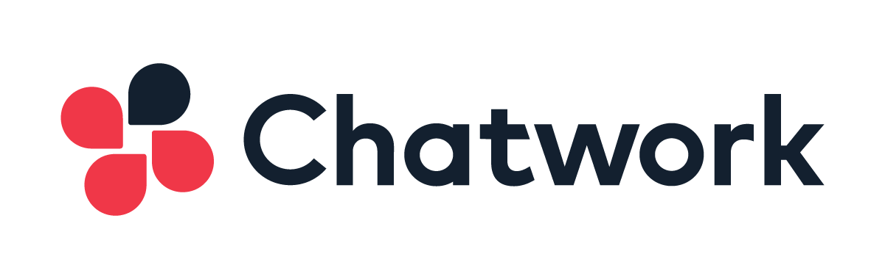
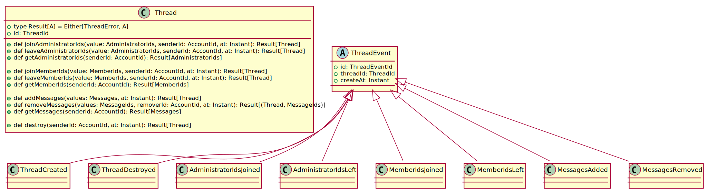
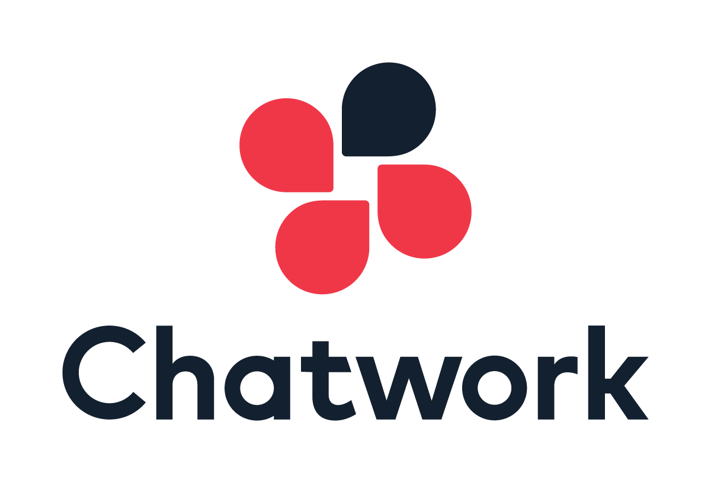

class: animation-fade impact

.top-bar[

]
.bottom-bar[
  ScalaMatsuri 2019
]

# How to build an Event-Sourcing system Ho
# using Akka with EKS

ScalaMatsuri 2019

Junichi Kato(@j5ik2o)

.center[]

---
title: How to build an Event-Sourcing system using Akka with EKS
class: animation-fade
layout: true

<!-- This slide will serve as the base layout for all your slides -->

.top-bar[
  {{title}}
]
.bottom-bar[
  ScalaMatsuri 2019
]

---

# Who am I

.col-6[
- Chatwork Tech-Lead
- github/j5ik2o
    - [scala-ddd-base](https://github.com/j5ik2o/scala-ddd-base)
    - [scala-ddd-base-akka-http.g8](https://github.com/j5ik2o/scala-ddd-base-akka-http.g8)
    - [reactive-redis](https://github.com/j5ik2o/reactive-redis)
    - [reactive-memcached](https://github.com/j5ik2o/reactive-memcached)
- Review
    - [Domain-Driven Design: Tackling Complexity in the Heart of Software (Japanese Edition)](https://amzn.to/2PmEHuU)
    - [Akka in Action (Japanese Edition)](https://amzn.to/2Qx54uU)
]

.col-6[
.center[]
]

.bottom-bar[
Chatworkテックリード。OSS活動&翻訳レビューなど
]
---

# Agenda

1. Event Sourcing with Akka
2. Deployment to EKS

- https://github.com/j5ik2o/thread-weaver

.bottom-bar[
AkkaでのES実装。EMSへのデプロイなどを話します。動作するソースコードはGithubにあります
]

???
今回のアジェンダはこのとおりです。
まずAkkaでのEventSourcingのやりかたについて
そのあとはEKSへのデプロイについて話します。

---
class: impact

# Akka with Event Sourcing

---

# Event Sourcing

- The latest state is derived by the events
- For example, transactions such as the e-commerce are sourced on events. This is nothing special.
- An event sequence represents an immutable history.
    - The transaction makes the following unique corrections. Events are never modified or deleted.
    - The order #0001 is canceled at the #0700, and the corrected data is registered at the slip #0701.

<table class="waffle" cellspacing="0" cellpadding="0">
<tbody>
  <tr style='height:20px;'>
    <td class="s2" dir="ltr">Slip Number</td>
    <td class="s2" dir="ltr">Product</td>
    <td class="s2" dir="ltr">Price</td>
    <td class="s2" dir="ltr">Quantity</td>
    <td class="s3 softmerge" dir="ltr">
      <div class="softmerge-inner" style="width: 309px; left: -1px;">Slip Number For Correction</div>
    </td>
    <td class="s4">Remarks</td>
  </tr>
  <tr style='height:20px;'>
    <td class="s2" dir="ltr">0001</td>
    <td class="s2" dir="ltr">A0123</td>
    <td class="s5" dir="ltr">5,000</td>
    <td class="s5" dir="ltr">10</td>
    <td class="s2" dir="ltr">0700</td>
    <td class="s6 softmerge" dir="ltr">
      <div class="softmerge-inner" style="width: 244px; left: -1px;">data before modification</div>
    </td>
  </tr>
  <tr style='height:20px;'>
    <td class="s2"></td>
    <td class="s2"></td>
    <td class="s2"></td>
    <td class="s2"></td>
    <td class="s2"></td>
    <td></td>
  </tr>
  <tr style='height:20px;'>
    <td class="s2" dir="ltr">0700</td>
    <td class="s2" dir="ltr">A0123</td>
    <td class="s5" dir="ltr">5,000</td>
    <td class="s5" dir="ltr">-10</td>
    <td class="s2" dir="ltr">0001</td>
    <td class="s7" dir="ltr">data for cancellation</td>
  </tr>
  <tr style='height:20px;'>
    <td class="s2" dir="ltr">0701</td>
    <td class="s2" dir="ltr">A0123</td>
    <td class="s5" dir="ltr">4,000</td>
    <td class="s5" dir="ltr">20</td>
    <td class="s2"></td>
    <td class="s7" dir="ltr">corrected data</td>
  </tr>
</tbody>
</table>

.bottom-bar[
状態はイベントから導出可能。取引はドメインイベントのよい例。イベントは列は不変な歴史を示す
]

???
- イベントソーシングとは何か？
- 最新状態をイベントによって導出することです。そのためにできることはすべて定義に入ります。
- たとえば、Eコマースにおける取引はイベントを基にしています。これは特別なことではありません。
- あるイベント列はある不変な歴史を表します
  - 取引は以下のユニークな訂正を行います。イベントは決して変更されたり削除されたりしません(イベントを巻き上げる以外は)
  - 注文 1番を700番でキャンセルし、701番で修正データを登録します 

---

# Domain Events

.col-6[
- Events that occurred in the past
- Domain Events are events that interest domain experts.
- Generally, Domain Events is expressed as a verb in past tense
  - CustomerRelocated
  - CargoShipped
]
.col-6[
- Events and commands are similar, but different languages ​​are handled by humans
  - Command may be rejected
  - Indicates that the event has already occurred
]  
.center[]

.bottom-bar[
イベントをモデリングの主軸にするのがES。ドメインイベントは動詞の過去形で表現される
]

???
EventSourcingはイベントをモデリングの主軸に起きます。つまりドメインで起こる過去の出来事にフォーカスします。
ドメインイベントはドメインエキスパートが関心を持つ出来事です。一般にドメインイベントは動詞の過去形で表現されます。
たとえば、顧客の引越や貨物の出荷など

---
class: impact

# Consider thread-weaver 
# as an example of a simple chat application.

.bottom-bar[
ESの事例としてシンプルなチャットアプリケーション thread-weaverを基に話しを進める
]

???
ここからは論よりコード。シンプルなチャットアプリケーションの事例として
thread-weaverという架空プロジェクトで話しを進めます。

---

# System requirements

- API server accepts commands and queries from API clients
- Create a thread to start the chat
- Only members can post to threads
- Only text messages posted to threads
- Omit authentication and authorization for convenience

.bottom-bar[
システム要件。API鯖を作る。チャットはスレッドを生成しメンバーとして投稿することで始められる
]

???
システム要件について
チャットはチャットメッセージをサーバとクライアントの間でやりとりできるようにします。
APIサーバはAPIクライアントからのコマンドとクエリを受け付けます
チャットを開始するためにスレッドを作ります。
スレッドに投稿できるのはメンバーだけです。
スレッドにはテキストメッセージをポストできます。
便宜上、認証・認可は省きます

---

# System Configuration

.col-6[
.center[]
]

.col-6[
- Split the application into the command stack and the query stack
- The command is sent to (clustered sharding) aggregate actor
- The aggregate actor stores(appends) domain events in storage when it accepts a command
- RMU(cluster sharding ) starts up in conjunction with the aggregation actor and reads the domain events for the appropriate aggregate ID immediately after startup, executes the SQL, and creates the Read-Model
- Query using DAO to load and return the lead model
- Deploy the api-server as a kubernetes pod
]

.bottom-bar[
システム構成。akka-cluster, CQRS, ShardingされたPersistentActor, RMU, DAOなどがキーコンポーネント。
]

???
システム構成です。
- アプリケーションをコマンドスタックとクエリスタックに分割します
- コマンドはクラスターシャーディングされた集約アクターに送信されます
- 集約アクターはコマンドを受け付けるとストレージにドメインイベントを書き込みます
- RMU（クラスタ共有）は集約アクタと連携して起動し、起動直後に適切な集約IDのドメインイベントを読み取り、SQLを実行してRead-Modelを作成します
- DAOを使用してリードモデルをロードして返します
- api-serverをkubernetesポッドとしてデプロイします。

---

class: impact

# Command stack side

???
それでは詳細にコマンド側をみていきましょう

.bottom-bar[
コマンド側から設計を考えましょう
]

---

# Domain Objects

.col-6[
- Account
    - Account information identifying the user of the system
- Thread
    - Indicates a place to exchange Messages
- Message
    - A hearsay written in some language
]
.col-6[
- Administrator
  - Administrator of the Thread
- Member
  - Users of the Thread
]
.center[]

.bottom-bar[
想定するドメインオブジェクト
]

???
- アカウント
  - システムのユーザーを識別するアカウント情報
- スレッド
  - メッセージを交換する場所を示します
- メッセージ
  - ある言語で書かれた伝聞
- 管理者
  - スレッドの管理者
- メンバー
  - スレッドのユーザ

---

# Commands/Domain Events

ThreadEvent sub types

- Create/Destroy Thread
    - ThreadCreated
    - ThreadDestroyed
- Join/Leave AdministratorIds
    - AdministratorIdsJoined
    - AdministratorIdsLeft
- Join/Leave MemberIds
    - MemberIdsJoined
    - MemberIdsLeft
- Add/Remove Messages
    - MessagesAdded 
    - MessagesRemoved

.bottom-bar[
コマンドとドメインイベント。コマンドが受理されるとドメインイベントが生成される
]

???
コマンドとドメインイベントについて。
以下のような命令に対応して、ドメインイベントが発生します。
ドメインイベントにフォーカスすると振る舞いとしてのコマンドが見えます。
これをそのままドメインの振る舞いとして実装しましょう。
管理者IDをINSERTしたりDELETEしたりというCUDの言葉より、JoinやLeaveという動詞を使う方が貧血症を回避できるでしょう。

---

# Layered architecture

.col-6[
- Clean Architecture
- Common
    - interface-adaptors
    - infrastructure
- Command side
    - use-cases
    - domain
- Query side
    - data access streams
    - data access objects
] 
.col-6[
.center[]
]

.bottom-bar[
レイヤー化アーキテクチャ。クリーンアーキテクチャっぽいものを想定。
]

???
ドメインを隔離するために、なんらかのレイヤー化アーキテクチャを使いましょう。
ここではクリーンアーキテクチャを採用しています。詳しい話は 藤井さんの実践 Clean Architecture のセッションを聞いてみてください。
共通のレイヤーはインターフェイスアダプタ層とインフラストラクチャ層です。
コマンドサイドはドメイン層とユースケース層です。
クエリサイドは非正規データにアクセスするためのDAOとそのストリームラッパーがあります。

---

# Projects structure

.center[
<object type="image/svg+xml" data="images/modules.svg" width="900"></object>
]

.bottom-bar[
プロジェクト構造。レイヤー間の依存はサブプロジェクトで強制します。依存には契約と実装の二つの種類があります
]

???
プロジェクト構造はこのようになります。contractsというモジュールはプロトコルと契約としてのインターフェイスのみを定義しています。
modulesというものは、実装が含まれます。依存の方向性は循環しないようになっています。

---

# Domain objects with actors

.col-8[
.center[
<object type="image/svg+xml" data="images/actor-tree.svg" ></object>
]
]
.col-4[
- Actors that fulfill all the functions are undesirable
- Follow object-oriented principles to build a hierarchy of actors with a single responsibility
]

.bottom-bar[
ドメインオブジェクトを含むアクターヒエラルキー。責務毎にアクターを分割する
]

???
次にドメインオブジェクトとアクターの関係性を示した図を説明します。
まずはじめにすべての機能を満たすアクターは必要ありません。
オブジェクト指向の原則に従って、単一の責任でアクターの階層を構築しましょう

---

# Thread

```scala
trait Thread {

  def isAdministratorId(accountId: AccountId): Boolean
  def isMemberId(accountId: AccountId): Boolean

  def joinAdministratorIds(value: AdministratorIds, senderId: AccountId, at: Instant): Result[Thread]
  def leaveAdministratorIds(value: AdministratorIds, senderId: AccountId, at: Instant): Result[Thread]
  def getAdministratorIds(senderId: AccountId): Result[AdministratorIds]

  def joinMemberIds(value: MemberIds, senderId: AccountId, at: Instant): Result[Thread]
  def leaveMemberIds(value: MemberIds, senderId: AccountId, at: Instant): Result[Thread]
  def getMemberIds(senderId: AccountId): Result[MemberIds]

  def addMessages(values: Messages, at: Instant): Result[Thread]
  def removeMessages(values: MessageIds, removerId: AccountId, at: Instant): Result[(Thread, MessageIds)]
  def getMessages(senderId: AccountId): Result[Messages]

  def destroy(senderId: AccountId, at: Instant): Result[Thread]
}
```

.bottom-bar[
ドメインオブジェクトのひとつであるThread。ユビキタス言語を反映したメソッドを持ちます
]

???
- 今回のドメインはThreadです。
- ユビキタス言語で表現される振る舞いのセットが定義されています。これらは副作用のない関数です。
---

# ThreadAggregate

.col-6[
```scala
class ThreadAggregate(id: ThreadId,
  subscribers: Seq[ActorRef]) extends Actor {
  // add messages handler
  private def commandAddMessages(thread: Thread): Receive = {
    case AddMessages(requestId, threadId,
      messages, createAt, reply) if threadId == id =>
      thread.addMessages(messages, createAt) match {
        case Left(exception) =>
          if (reply)
            sender() ! AddMessagesFailed(ULID(), requestId,
              threadId, exception.getMessage, createAt)
        case Right(newThread) =>
          if (reply)
            sender() ! AddMessagesSucceeded(ULID(), requestId,
              threadId, messages.toMessageIds, createAt)
          context.become(onCreated(newThread))
      }
  }
  
  override def receive: Receive = { /*...*/ }
}
```
]
.col-6[
- Actors that support transactional integrity
- The boundary of the data update is the same as the boundary the aggregates has
- For example, when an actor receives CreateThead command, a Thread state is generated internally
- Then Messages are also added to the Thread when the AddMessages command is received
- If the other commands defined in the protocol are received by the Actor, the Actor will have corresponding side effects.
]

.bottom-bar[
ドメインオブジェクトを集約するアクターを実装。集約は強い整合性をサポートする
]

???
- トランザクションの整合性をサポートするアクター
- データ更新の境界は、集約の境界と同じです。
- たとえば、アクターがCreateTheadコマンドを受け取ると、内部でThread状態が生成されます。
- その後、AddMessagesコマンドを受信したときにメッセージもスレッドに追加されます。
- プロトコルで定義された他のコマンドがアクターによって受信された場合、アクターは対応する副作用を持ちます。

---

# ThreadAggreateSpec

.col-6[
```scala
val threadId        = ThreadId()
val threadRef       = newThreadRef(threadId)
val now             = Instant.now
val administratorId = AccountId()
val title           = ThreadTitle("test")

threadRef ! CreateThread(ULID(), threadId, administratorId, 
  None, title, None, AdministratorIds(administratorId),
  MemberIds.empty, now, reply = false)

val messages = Messages(TextMessage(MessageId(), None, 
  ToAccountIds.empty, Text("ABC"), memberId, now, now))
threadRef ! AddMessages(ULID(), threadId, messages, 
  now, reply = true)

expectMsgType[AddMessagesResponse] match {
 case f: AddMessagesFailed =>
   fail(f.message)
 case s: AddMessagesSucceeded =>
   s.threadId shouldBe threadId
   s.createAt shouldBe now
}
```
]
.col-6[
- Verify that add messages and create a thread by using Test Kit
]

.bottom-bar[
メッセージパッシングを使ってテストを実装します
]

???
- このようにメッセージパッシングを使ってテストを実装します

---

# PersistentThreadAggregate(1/2)

.col-6[
```scala
object PersistentThreadAggregate {
  def props(id: ThreadId, subscribers: Seq[ActorRef]): Props =
      ...
}

class PersistentThreadAggregate(id: ThreadId, 
  subscribers: Seq[ActorRef], 
  propsF: (ThreadId, Seq[ActorRef]) => Props)
    extends PersistentActor with ActorLogging {

  override def supervisorStrategy: SupervisorStrategy = 
    OneForOneStrategy() { case _: Throwable => Stop }

  private val childRef =
    context.actorOf(propsF(id, subscribers), 
      name = ThreadAggregate.name(id))
  context.watch(childRef)

  // persistenceIdえ is the partition keでもスレッドIDに対応するf persistenceId: String = ThreadAggregate.name(id)

  override def receiveRecover: Receive = {
    case e: ThreadCommonProtocol.Event with ToCommandRequest =>
      childRef ! e.toCommandRequest
    case RecoveryCompleted =>
      log.debug("recovery completed")
  }
```
]
.col-6[
- Actors that add the persistence function to ThreadAggregate
- Domain behavior is provided by child actors
- The recover process sends commands generated from events to child actors.
]

.bottom-bar[
メッセージパッシングを使ってテストを実装します
]

???
- ThreadAggregateに永続化機能を追加するアクターです
- ドメインの振る舞いは子アクターによって提供されます
- receiveRecover処理は、ドメインイベントから生成されたコマンドを子アクターに送信します

---

# PersistentThreadAggregate(2/2)

.col-6[
```scala
  override def receiveCommand: Receive = {
    case Terminated(c) if c == childRef =>
      context.stop(self)
    case m: CommandRequest with ToEvent =>
      childRef ! m
      context.become(sending(sender(), m.toEvent))
    case m =>
      childRef forward m
  }
  
  private def sending(replyTo: ActorRef, 
    event: ThreadCommonProtocol.Event): Receive = {
    case s: CommandSuccessResponse => persist(event) { _ =>
        replyTo ! s
        unstashAll()
        context.unbecome()
      }
    case f: CommandFailureResponse =>
      replyTo ! f
      unstashAll()
      context.unbecome()
    case _ =>
      stash()
  }
}
```
]

.col-6[
- Delegate to child actors when receiving commands. Persists only on success
- message processing is suspended until a command response is returned
]

.bottom-bar[
実際のドメインの振る舞いは子アクターが実現する。コマンドの応答が返されるまでメッセージ処理は一時退避される
]

???
- コマンドを受信したとき、子アクターに委譲します
- そのコマンドの応答が返されるまで、メッセージ処理は一時停止されます。

---

# PersitentThreadAggregateSpec

.col-8[
```scala
// Create id = 1 of Thread actor
threadRef1 ! CreateThread(ULID(), threadId, administratorId, None, title, None, 
  AdministratorIds(administratorId), MemberIds.empty, now, reply = false)
val messages = Messages(TextMessage(MessageId(), None, 
  ToAccountIds.empty, Text("ABC"), memberId, now, now))
threadRef1 ! AddMessages(ULID(), threadId, messages, now, reply = false)

//Stop id = 1 of Thread actor
killActors(threadRef)

// Recover id = 1 of Thread actor
val threadRef2 = system.actorOf(PersistentThreadAggregate.props(threadId, Seq.empty))

// Check if it is in the previous state
threadRef2 ! GetMessages(ULID(), threadId, memberId, now)
expectMsgType[GetMessagesResponse] match {
  case f: GetMessagesFailed =>
    fail(f.message)
  case s: GetMessagesSucceeded =>
    s.threadId shouldBe threadId
    s.createAt shouldBe now
    s.messages shouldBe messages
}
```
]
.col-4[
- a test that intentionally stops and restarts the persistence actor
- Replayed state after reboot
]
.bottom-bar[
永続化アクターを意図的に停止して再起動するテスト。再起動後に状態をリプレイする
]

???
- 永続化アクターを意図的に停止して再起動するテスト
- 再起動後に状態をリプレイできます

---

# FYI: akka-persistence plugin

- Different plugins for different databases
  - [Akka Persistence journal and snapshot plugins](https://index.scala-lang.org/search?topics=akka-persistence&_ga=2.59796846.298215744.1559990739-503694813.1531235856)
- Default corresponds to LevelDB
- recommended on AWS is DynamoDB. There are the following plugins, but I recommend my plugin:P
    - https://github.com/j5ik2o/akka-persistence-dynamodb
    - https://github.com/akka/akka-persistence-dynamodb

---

# FYI: akka-persistence plugin

- akka plugin 
    - is complex schema 
    - doesn't support the query function.
    - doesn't support non-blocking I/O (by aws-sdk v2)
    
.col-6[
#### akka/akka-persistence-dynamodb

```hcon
# PersistentRepr
PKey: par = <journalName>-P-<persistenceId>-<sequenceNr / 100>
SKey: num = <sequenceNr % 100>
pay = <payload> 
idx = <atomic write batch index>
cnt = <atomic write batch max index>
# 高いシーケンス番号
PKey: par = <journalName>-SH-<persistenceId>-<(sequenceNr / 100)
   % sequenceShards>
SKey: num = 0 
seq = <sequenceNr rounded down to nearest multiple of 100>
# 低シーケンス番号
PKey: par = <journalName>-SL-<persistenceId>-<(sequenceNr / 100)
   % sequenceShards>
SKey: num = 0
seq = <sequenceNr, not rounded>
```
]
.col-6[
#### j5ik2o/akka-persistence-dynamodb

```hcon
# PrimaryIndex(for Writing)
PKey: pkey = ${PersistenceId}-${SequenceNumber % ShardCount}
SKey: sequence-nr = ${SequenceNumber}
# GSI:GetJournalRows(for Reading)
persistence-id = ${PersistenceId}
sequence-nr = ${SequenceNumber}
# GSI:TagsIndex(for Reading)
tags = ...
```
]


---

# FYI: akka-persistence plugin

.col-6[
```scala
// build.sbt
libraryDependencies ++= Seq(
  // ...
  "com.typesafe.akka" %% "akka-persistence" % akkaVersion,
  "org.fusesource.leveldbjni" % "leveldbjni-all" % "1.8" % Test,
  "org.iq80.leveldb" % "leveldb" % "0.9" % Test,
  "com.github.j5ik2o" %% "akka-persistence-dynamodb" % "1.0.2",
  // ...
)
```
]
.col-6[
```hcon
// application.conf
akka {
  persistence {
    journal {
      plugin = dynamo-db-journal
    }
    snapshot-store {
      plugin = dynamo-db-snapshot
    }
  }
}
```
]
.bottom-bar[
akka-persistence pluginには様々なプラグインがある。AWSでのお勧めは私が作ったDynamoDBプラグイン
]

---


# ThreadAggregates(Message Broker)

.col-8[
```scala
class ThreadAggregates(subscribers: Seq[ActorRef], 
    propsF: (ThreadId, Seq[ActorRef]) => Props)
    extends Actor
    with ActorLogging
    with ChildActorLookup {
  override type ID             = ThreadId
  override type CommandRequest = ThreadProtocol.CommandMessage
  
  override def receive: Receive = forwardToActor

  override protected def childName(childId: ThreadId): String = 
    childId.value.asString
  override protected def childProps(childId: ThreadId): Props = 
    propsF(childId, subscribers)
  override protected def toChildId(commandRequest: CommandMessage): ThreadId = 
    commandRequest.threadId
}
```
]
.col-4[
- The message broker that bundles multiple ThreadAggregates as child actors 
- Most of the logic is in ChildActorLookup
- Resolve the actor name from ThreadId in the command message, and transfer the message to the corresponding child actor.  If there is no child actor, generate an actor and then forward the message to the actor
]
.bottom-bar[
複数のThreadAggregateを子アクターとして束ねるメッセージブローカー
]

???
- 複数のThreadAggregateを子アクターとして束ねるメッセージブローカー
- ほとんどのロジックはChildActorLookupにあります
- コマンドメッセージ内のThreadIdからアクター名を解決し、対応づく子アクターにメッセージを転送します。子アクターがいない場合は子アクターを生成してからメッセージを転送します。

---

# ChildActorLookup

.col-8[
```scala
trait ChildActorLookup extends ActorLogging { this: Actor =>
  implicit def context: ActorContext
  type ID
  type CommandRequest

  protected def childName(childId: ID): String
  protected def childProps(childId: ID): Props
  protected def toChildId(commandRequest: CommandRequest): ID

  protected def forwardToActor: Actor.Receive = {
    case _cmd =>
      val cmd = _cmd.asInstanceOf[CommandRequest]
      context
        .child(childName(toChildId(cmd)))
        .fold(createAndForward(cmd, toChildId(cmd)))(forwardCommand(cmd))
  }

  protected def forwardCommand(cmd: CommandRequest)(childRef: ActorRef): Unit =
    childRef forward cmd

  protected def createAndForward(cmd: CommandRequest, childId: ID): Unit = 
    createActor(childId) forward cmd

  protected def createActor(childId: ID): ActorRef =
    context.actorOf(childProps(childId), childName(childId))
}
```
]
.col-4[
- Create a child actor if none exists and forward the message
- forward the message to its child actors, if any
]
.bottom-bar[
メッセージブローカはメッセージを転送しますが、内部で子アクターの生成も担当する
]

???
メッセージブローカはメッセージを転送しますが、内部で子アクターの生成も担当します。

---

# ShardedThreadAggregates (1/2)

.col-6[
```scala
object ShardedThreadAggregates {

  def props(subscribers: Seq[ActorRef], 
    propsF: (ThreadId, Seq[ActorRef]) => Props): Props =
    Props(new ShardedThreadAggregates(subscribers, propsF))

  def name(id: ThreadId): String = id.value.asString

  val shardName = "threads"

  case object StopThread

　// function to extract an entity id
  val extractEntityId: ShardRegion.ExtractEntityId = {
    case cmd: CommandRequest => (cmd.threadId.value.asString, cmd)
  }

  // function to extract a shard id
  val extractShardId: ShardRegion.ExtractShardId = {
    case cmd: CommandRequest =>
      val mostSignificantBits  = cmd.threadId
        .value.mostSignificantBits  % 12
      val leastSignificantBits = cmd.threadId 
        .value.leastSignificantBits % 12
      s"$mostSignificantBits:$leastSignificantBits"
  }

}
```
]
.col-6[
- Allow ThreadAggregates to be distributed across a cluster
- extractEntityId is the function to extract an entity id
- extractShardId is the function to extract a shard id
]
.bottom-bar[
ThreadAggregateをクラスタ全体に分散できるようにする
]

???
-  ThreadAggregateをクラスタ全体に分散できるようにする
-  extractEntityIdはエンティティIDを抽出するための関数です
-  extractShardIdはシャードIDを抽出する関数です

---

# ShardedThreadAggregates (2/2)

.col-6[
```scala
class ShardedThreadAggregates(subscribers: Seq[ActorRef], 
  propsF: (ThreadId, Seq[ActorRef]) => Props)
    extends ThreadAggregates(subscribers, propsF) {
  context.setReceiveTimeout(
    Settings(context.system).passivateTimeout)

  override def unhandled(message: Any): Unit = message match {
    case ReceiveTimeout =>
      log.debug("ReceiveTimeout")
      context.parent ! Passivate(stopMessage = StopThread)
    case StopThread =>
      log.debug("StopWallet")
      context.stop(self)
  }
}
```
]
.col-6[
- Inherit ThreadAggregates
- Then add an implementation to passivate ShardedThreadAggregates when occurred ReceiveTimeout 
]
.bottom-bar[
ShardedThreadAggregatesはThreadAggregatesを継承。一定時間を過ぎたらランタイムから退避させる設定を追加する
]

???
- ShardedThreadAggregatesはThreadAggregatesを継承します
- 一定時間を過ぎたらアクターをランタイムから退避させる設定を追加します

---

# ShardedThreadAggregatesRegion

.col-6[
```scala
object ShardedThreadAggregatesRegion {

  def startClusterSharding(subscribers: Seq[ActorRef])
    (implicit system: ActorSystem): ActorRef =
    ClusterSharding(system).start(
      ShardedThreadAggregates.shardName,
      ShardedThreadAggregates.props(subscribers, 
        PersistentThreadAggregate.props),
      ClusterShardingSettings(system),
      ShardedThreadAggregates.extractEntityId,
      ShardedThreadAggregates.extractShardId
    )

  def shardRegion(implicit system: ActorSystem): ActorRef =
    ClusterSharding(system)
      .shardRegion(ShardedThreadAggregates.shardName)
}
```
]
.col-6[
- The startClusterSharing method will start ClusterSharing with the specified settings
- The shardRegion method gets the ActorRef to the started ShardRegion.
]
.bottom-bar[
最後にクラスターシャーディングのためユーティリティを定義
]


???
- startClusterSharingメソッドは指定した設定に基づいてクラスターシャーディングを開始します
- shardRegionメソッドは開始されたShardRegionへのActor参照を返します

---

# MultiJVM Testing(by using sbt-multi-jvm)

```scala
"setup shared journal" in {
  Persistence(system)
  runOn(controller) { system.actorOf(Props[SharedLeveldbStore], "store") }
  enterBarrier("persistence-started")
  runOn(node1, node2) {
    system.actorSelection(node(controller) / "user" / "store") ! Identify(None)
    val sharedStore = expectMsgType[ActorIdentity].ref.get
    SharedLeveldbJournal.setStore(sharedStore, system)
  }
  enterBarrier("setup shared journal")
}
"join cluster" in within(15 seconds) {
  join(node1, node1) { ShardedThreadAggregatesRegion.startClusterSharding(Seq.empty) }
  join(node2, node1) { ShardedThreadAggregatesRegion.startClusterSharding(Seq.empty) }
  enterBarrier("join cluster")
}
"createThread" in { runOn(node1) {
    val accountId = AccountId(); val threadId  = ThreadId(); val title = ThreadTitle("test")
    val threadRef = ShardedThreadAggregatesRegion.shardRegion
    threadRef ! CreateThread(ULID(), threadId, accountId, None, title, None, AdministratorIds(accountId), 
      MemberIds.empty, Instant.now, reply = true)
    expectMsgType[CreateThreadSucceeded](10 seconds).threadId shouldBe threadId
  }
  enterBarrier("create thread")
}
```
.bottom-bar[
sbt-multi-jvmを使ったテスト
]

???
これはMultiJVMテストの例です。
akka-persistenceの初期化とクラスターメンバーのジョイン後に、スレッドを作成する処理を記述しています。
ローカルアクターにメッセージを送信するとの同じようにRPCを実現します。これは非同期でかつノンブロッキングです。

---

# cluster-sharding with persistence

.col-8[
.center[
<object type="image/svg+xml" data="images/akka-event-sourcing.svg" height="500"></object>
]
]
.col-4[
- Actors with state in on-memory are distributed across the cluster
- Domain events that occur are saved in partitioned storage by aggregate ID
]
.bottom-bar[
akka-cluster-shardingとakka-persistenceの構成振り返り
]

???
cluster-shardingとpersistenceを振り返ります。
- 状態をオンメモリに保持したアクターはクラスター上に分散されます
- 発生したドメインイベントは、集約ID毎にパーティショニングされたストレージに追記保存されます

---

# CreateThreadUseCaseUntypeImpl

```scala
class CreateThreadUseCaseUntypeImpl(
    threadAggregates: ThreadActorRefOfCommandUntypeRef, parallelism: Int = 1, timeout: Timeout = 3 seconds
)(implicit system: ActorSystem) extends CreateThreadUseCase {
  override def execute: Flow[UCreateThread, UCreateThreadResponse, NotUsed] =
    Flow[UCreateThread].mapAsync(parallelism) { request =>
      implicit val to: Timeout                  = timeout
      implicit val scheduler: Scheduler         = system.scheduler
      implicit val ec: ExecutionContextExecutor = system.dispatcher
      (threadAggregates ? CreateThread(
        ULID(), request.threadId, request.creatorId, None, request.title, request.remarks,
        request.administratorIds, request.memberIds, request.createAt, reply = true
      )).mapTo[CreateThreadResponse].map {
        case s: CreateThreadSucceeded =>
          UCreateThreadSucceeded(s.id, s.requestId, s.threadId, s.createAt)
        case f: CreateThreadFailed =>
          UCreateThreadFailed(f.id, f.requestId, f.threadId, f.message, f.createAt)
      }
    }
}
```
.bottom-bar[
ユースケースクラスの実装例。アクターをラップしストリームに結合できるように
]

???
より複雑なユースケースではワークフローを制御しますが、このユースケースでは単純にスレッド集約にコマンドを送信し応答を待ちます。
また、プロトコルとしてのメッセージは変換します。

---

# ThreadCommandControllerImpl

.col-6[
```scala
trait ThreadCommandControllerImpl
  extends ThreadCommandController 
  with ThreadValidateDirectives {
  private val createThreadUseCase = bind[CreateThreadUseCase]
  private val createThreadPresenter = bind[CreateThreadPresenter]

  override private[controller] def createThread: Route = 
    path("threads" / "create") {
      post {
        extractMaterializer { implicit mat =>
          entity(as[CreateThreadRequestJson]) { json =>
            validateJsonRequest(json).apply { commandRequest =>
              val responseFuture = Source.single(commandRequest)
                .via(createThreadUseCase.execute)
                .via(createThreadPresenter.response)
                .runWith(Sink.head)
              onSuccess(responseFuture) { response =>
                complete(response)
              }
            }
          }
        }
      }
    }
```
]
.col-6[
- Command side controller
- The thread creation root composes several directives and calls a use case
- The request JSON returns a command if validation passes. Pass the command to the use-case and execute it
- The presenter will convert the use-case result to Response JSON
]
.bottom-bar[
コマンド側のコントローラ。バリデーションとユースケースの実行とプレゼンターの実行を行う
]


???
- コマンドサイドのコントローラです。クエリとは責務が異なるので分離しました。
- スレッド作成用ルートはいくつかのディレクティブを合成しユースケースを呼び出します
- リクエスト用JSONはバリデーションをパスするとコマンドを返します。コマンドをユースケースに渡し実行します。
- 実行結果はプレゼンタがレスポンス用JSONに変換します

---

class: impact

# Read Model Updater side

---

# FYI: akka-typed

- The message type received by the message handler was Any, but akka-typed allows the Message type to be specified
- There is basically no compatibility, so there are many things to remember. Let's get used to it now

.col-6[
```scala
object PingPong extends App {

  trait Message
  case class Ping(reply: ActorRef[Message]) extends Message
  case object Pong                          extends Message

  def receiver: Behavior[Message] =
    Behaviors.setup[Message] { ctx =>
      Behaviors.receiveMessagePartial[Message] {
        case Ping(replyTo) =>
          ctx.log.info("ping")
          replyTo ! Pong
          Behaviors.same
      }
    }
```
]
.col-6[
```scala

  def main: Behavior[Message] = Behaviors.setup { ctx =>
    val receiverRef = ctx.spawn(receiver, name = "receiver")
    receiverRef ! Ping(ctx.self)
    Behaviors.receiveMessagePartial[Message] {
      case Pong =>
        ctx.log.info("pong")
        receiverRef ! Ping(ctx.self)
        Behaviors.same
    }
  }

  ActorSystem(main, "ping-pong")

}
```
]
.bottom-bar[
受け取るメッセージ型を指定できるようになった。APIには互換性がない
]
???
- メッセージハンドラで受け取るメッセージ型はAnyだったが、型を指定できるようになった
- 基本的に互換性がないので、覚えることが多い。今のうちになれておこう

---

# Read Model Updater(1/3)


.col-6[
.center[
<object type="image/svg+xml" data="images/separate-node-layout.svg" width="500"></object>
]
]
.col-6[
- Starts the Read Model Updater (RMU) for each aggregation ID
- Sharding to allow multiple RMUs to boot on a single node
- Starting and stopping the RMU is triggered by events on the aggregate actor. It actually does message translation with AggregateToRMU.
]
.bottom-bar[
集約IDごとにRead Model Updater(RMU)を起動
]
???
- 集約IDごとにRead Model Updater(RMU)を起動させる
- 1ノードで複数のRMUが起動できるようにシャーディングする
- RMUの起動と停止は集約アクターのイベントをきっかけにする。実際にはAggregateToRMUでメッセージ変換を行う

---

# Read Model Updater(2/3)

.col-7[
```scala
private def projectionSource(sqlBatchSize: Long, threadId: ThreadId)
  (implicit ec: ExecutionContext): Source[Vector[Unit], NotUsed] = {
  Source
    .fromFuture(
      db.run(getSequenceNrAction(threadId)).map(_.getOrElse(0L))
    ).log("lastSequenceNr").flatMapConcat { lastSequenceNr =>
      readJournal
        .eventsByPersistenceId(threadId.value.asString, 
          lastSequenceNr + 1, Long.MaxValue)
    }.log("ee").via(sqlActionFlow(threadId))
    .batch(sqlBatchSize, ArrayBuffer(_))(_ :+ _).mapAsync(1) { sqlActions =>
      db.run(DBIO.sequence(sqlActions.result.toVector))
    }.withAttributes(logLevels)
}
```
]
.col-5[
- RMU does not end stream processing
-persistenceId also gets the latest sequence number corresponding to the thread ID
- read events from readJournal since thread ID and last sequence number
- sqlActionFlow converts events to SQL
- Finally, run the SQL in batches (Read model not denormalized to be flexible to query patterns)
]
.bottom-bar[
RMUは終わらないストリーム処理を行う
]
???
- RMUは終わらないストリーム処理を行います
- persistenceIdでもスレッドIDに対応する最新のシーケンス番号を取得します
- スレッドIDと最新のシーケンス番号以降のイベントをreadJournalから読み込みます
- sqlActionFlowではイベントをSQLに変換します
- 最後にSQLをまとめて実行します(問い合わせパターンに柔軟に対応するためリードモデルを非正規化していません)
---

# Read Model Updater(2/2)

.col-8[
```scala 
class ThreadReadModelUpdater(
    val readJournal: ReadJournalType,
    val profile: JdbcProfile, val db: JdbcProfile#Backend#Database
) extends ThreadComponent with ThreadMessageComponent ... {
  import profile.api._

  def behavior(sqlBatchSize: Long = 10, 
    backoffSettings: Option[BackoffSettings] = None): Behavior[CommandRequest] =
    Behaviors.setup[CommandRequest] { ctx =>
      Behaviors.receiveMessagePartial[CommandRequest] {
        case s: Start =>
          ctx.child(s.threadId.value.asString) match {
            case None =>
              ctx.spawn(
                projectionBehavior(sqlBatchSize, backoffSettings, s.threadId),
                name = s"RMU-${s.threadId.value.asString}"
              ) ! s
            case _ =>
              ctx.log.warning(
                "RMU already has started: threadId = {}", s.threadId.value.asString)
          }
          Behaviors.same
      }
    }
    // ...
}
```
]
.col-4[
- RMU starts stream processing when it receives a Start message.
- Stream processing is performed as a task on a child actor
]
.bottom-bar[
RMUはStartメッセージを受け取るとストリーム処理を開始する
]
???
- RMUはStartメッセージを受け取るとストリーム処理を開始します。
- ストリーム処理は子アクターのタスクとして実行されます

---

# ShardedThreadReadModelUpdater(1/3)

```scala
class ShardedThreadReadModelUpdater(
    val readJournal: ReadJournalType,
    val profile: JdbcProfile,
    val db: JdbcProfile#Backend#Database
) {
  val TypeKey: EntityTypeKey[CommandRequest] = EntityTypeKey[CommandRequest]("threads-rmu")

  def initEntityActor(
      clusterSharding: ClusterSharding,
      receiveTimeout: FiniteDuration
  ): ActorRef[ShardingEnvelope[CommandRequest]] =
    clusterSharding.init(
      Entity(typeKey = TypeKey, createBehavior = behavior(receiveTimeout)).withStopMessage(Stop)
    )
// ...
```
.bottom-bar[
akka-typedでのcluster-shardingのやり方
]

---

# ShardedThreadReadModelUpdater(2/3)

```scala
// ...
  private def behavior(
      receiveTimeout: FiniteDuration, sqlBatchSize: Long = 10, backoffSettings: Option[BackoffSettings] = None
  ): EntityContext => Behavior[CommandRequest] = { entityContext =>
    Behaviors.setup[CommandRequest] { ctx =>
      // setting receive timeout
      ctx.setReceiveTimeout(receiveTimeout, Idle)
      val childRef = ctx.spawn(new ThreadReadModelUpdater(readJournal, profile, db).behavior(sqlBatchSize, backoffSettings),
        name = "threads-rmu")
      Behaviors.receiveMessagePartial {
        case Idle => entityContext.shard ! ClusterSharding.Passivate(ctx.self); Behaviors.same
        case Stop => Behaviors.stopped
        case msg => childRef ! msg; Behaviors.same
      }
    }
  }
// ...
```

.bottom-bar[
APIは異なるがやることは同じ
]
---

# ShardedThreadReadModelUpdater(3/3)

- MUST send the ShardingEnvelope to the ShardRegion. ShadedThreadReadModelUpdaterProxy converts CommandRequest into ShardingEnvelope and forwards it

```scala
class ShardedThreadReadModelUpdaterProxy(
    val readJournal: ReadJournalType, val profile: JdbcProfile, val db: JdbcProfile#Backend#Database
) {
  def behavior(clusterSharding: ClusterSharding, receiveTimeout: FiniteDuration): Behavior[CommandRequest] =
    Behaviors.setup[CommandRequest] { _ =>
      val actorRef =
        new ShardedThreadReadModelUpdater(readJournal, profile, db).initEntityActor(clusterSharding, receiveTimeout)
      Behaviors.receiveMessagePartial[CommandRequest] {
        case msg =>
          actorRef ! typed.ShardingEnvelope(msg.threadId.value.asString, msg)
          Behaviors.same
      }
    }
}
```
.bottom-bar[
ShardedThreadReadModelUpdaterProxyではCommandRequestをShardingEnvelopeに変換して転送する
]
???
ShardingEnvelopeをShardRegionに送る必要がある。ShardedThreadReadModelUpdaterProxyではCommandRequestをShardingEnvelopeに変換して転送する

---

# Interlocking of Aggreagte and RMU

.col-7[
```scala
object AggregateToRMU {

  def behavior(
      rmuRef: ActorRef[ThreadReadModelUpdaterProtocol.CommandRequest]
  ): Behavior[ThreadCommonProtocol.Message] =
    Behaviors.setup[ThreadCommonProtocol.Message] { ctx =>
      Behaviors.receiveMessagePartial[ThreadCommonProtocol.Message] {
        case s: Started =>
          ctx.log.debug(s"RMU ! $s")
          rmuRef ! ThreadReadModelUpdaterProtocol.Start(
            ULID(), s.threadId, Instant.now)
          Behaviors.same
        case s: Stopped =>
          ctx.log.debug(s"RMU ! $s")
          rmuRef ! ThreadReadModelUpdaterProtocol.Stop(
            ULID(), s.threadId, Instant.now)
          Behaviors.same
      }

    }

}
```
]
.col-5[
- These two actors are separated because they have different responsibilities, but start and stop work together
- Actually there is a problem with this method. If only the RMU stops due to a node failure, the RMU cannot recover until it receives the Start message again. The downside is that ThreadAggregate must periodically send heartbeat beads.
]
.bottom-bar[
イベントとメッセージの変換を行うアクター
]
???
- この二つのアクターは責務が異なるので分離されていますが、起動と停止は連動します
- この方法はあまりよくありません。ノード故障でRMUだけが停止した場合、再度Startメッセージを受信しないとリカバリできないからです。ThreadAggregateから定期的にハートビードを受ける方法もありますが、RMUをThreadAggreagteの子アクターにする方法もあります。

---

# Improvement for RMU

.col-6[
.center[
<object type="image/svg+xml" data="images/same-node-layout.svg" width="500"></object>
]
]
.col-6[
- Another implementation pattern is to make the RMU a child actor of PersistentThreadAggregate.
- This method allows you to watch the RMU as a child actor so that it can be restarted if the RMU should stop.
- However, PersistentThreadAggregate is responsible for RMU responsibilities. Duplicate Responsibilities?
]
.bottom-bar[
改善の余地がある。どちらのヒエラルキーがよいかは試してみてください
]
???
- もうひとつの実装パターンは、RMUをPersistentThreadAggregateの子アクターにする方法です。
- この方法はRMUを子アクターとしてwatchできるようになるので、万が一RMUが停止しても再起動が可能です。
- ただしPersistentThreadAggregateがRMU責務を担うことになります。責務の重複？

---

class: impact

# Query stack side

???
それでは詳細にクエリ側をみていきましょう

.bottom-bar[
クエリスタック側
]
---

# ThreadQueryControllerImpl

.col-7[
```scala
trait ThreadQueryControllerImpl 
  extends ThreadQueryController
  with ThreadValidateDirectives {
  private val threadDas: ThreadDas = bind[ThreadDas]
  // ...
  override private[controller] def getThread: Route =
    path("threads" / Segment) { threadIdString => get {
      // ...
      parameter('account_id) { accountValue =>
        validateAccountId(accountValue) { accountId =>
          onSuccess(threadDas.getThreadByIdSource(accountId, threadId)
            .via(threadPresenter.response)
            .runWith(Sink.headOption[ThreadJson]).map(identity)) { 
              case None => 
                reject(NotFoundRejection("thread is not found", None))
              case Some(response) => 
                complete(GetThreadResponseJson(response)) 
          }
        }
      }
    // ...
    }
  // ...
}
```
]
.col-5[
- The query side uses a stream wrapped Dao object instead of a use case.
- Same as command side except for this.
]
.bottom-bar[
クエリサイドではユースケースではなくDaoをストリームでラップしたオブジェクトを利用
]

???
- クエリサイドのコントローラです
- クエリサイドではユースケースではなくDaoをストリームでラップしたオブジェクトを利用します。
- これ以外はコマンドサイドと同様です。

---

# ThreadControllerSpec

.col-6[
```scala
val administratorId = ULID().asString
val entity = CreateThreadRequestJson(
    administratorId, None, "test",
    None, Seq(administratorId), Seq.empty,
    Instant.now.toEpochMilli
  ).toHttpEntity

Post(RouteNames.CreateThread, entity) ~> 
  commandController.createThread ~> check {
  response.status shouldEqual StatusCodes.OK
  val responseJson = responseAs[CreateThreadResponseJson]
  responseJson.isSuccessful shouldBe true
  val threadId = responseJson.threadId.get

  eventually { // repeat util read
    Get(RouteNames.GetThread(threadId, administratorId)) ~> 
      queryController.getThread ~> check {
      response.status shouldEqual StatusCodes.OK
      val responseJson = responseAs[GetThreadResponseJson]
      responseJson.isSuccessful shouldBe true
    }
  }
}
```
]
.col-6[
- a test where two controllers are connected.
- Verify threads are readable after they are created
- Works fine
]
.bottom-bar[
二つのコントローラをつなげたテスト。スレッドを作成後にスレッドが読めるようになるかを検証
]
???
- 二つのコントローラをつなげたテストです
- スレッドを作成後にスレッドが読めるようになるかを検証します
- 正常に機能します

---

# Bootstrap

- Start AkkaManagement and ClusterBootstrap, then start akka-http server

```scala
object Main extends App {
  // ...

  implicit val system: ActorSystem                        = ActorSystem("thread-weaver-api-server", config)
  implicit val materializer: ActorMaterializer            = ActorMaterializer()
  implicit val executionContext: ExecutionContextExecutor = system.dispatcher
  implicit val cluster                                    = Cluster(system)

  AkkaManagement(system).start()
  ClusterBootstrap(system).start()

  // ...

  val routes = session
      .build[Routes].root ~ /* ... */

  val bindingFuture = Http().bindAndHandle(routes, host, port).map { serverBinding =>
    system.log.info(s"Server online at ${serverBinding.localAddress}")
    serverBinding
  }

  // ...

}
```
.bottom-bar[
AkkaManagementとClusterBootstrapを開始した後にakka-httpサーバを起動
]

???
- Start AkkaManagement and ClusterBootstrap and akka-http server

---

# FYI: Akka Cluster

.col-6[
- [Cluster Specification](https://doc.akka.io/docs/akka/current/common/cluster.html)

- Node
    - A logical member of a cluster. There could be multiple nodes on a physical machine. Defined by a hostname:port:uid tuple.
- Cluster
    - A set of nodes joined together through the membership service.
- leader
    - A single node in the cluster that acts as the leader. Managing cluster convergence and membership state transitions.
- Seed Nodes
    - The seed nodes are configured contact points for new nodes joining the cluster. When a new node is started it sends a message to all seed nodes and then sends a join command to the seed node that answers first.  
]
.col-6[
.center[
<object type="image/svg+xml" data="images/cluster-image.svg" height="400"></object>
]
]
.bottom-bar[
Akka-Clusterの概念理解は公式ドキュメントを参照してください
]
---

# FYI: Akka Management

- Akka Management is a suite of tools for operating Akka Clusters.
- modules
    - akka-management: HTTP management endpoints and health checks
    - akka-managment-cluster-http:  Provides HTTP endpoints for cluster monitoring and management
    - akka-managment-cluster-bootstrap: Supports cluster bootstrapping by using akka-discovery
    - akka-discovery-kubernetes-api: Module for managing k8s pod as a cluster member
.bottom-bar[
Akka-Clusterの運用をサポートするツール群がAkka Management
]
???
- モジュール
    - akka-management: HTTP管理エンドポイントとヘルスチェック機能
    - akka-managment-cluster-http: クラスターの監視とマネジメントのためのHTTPエンドポイントを提供する
    - akka-managment-cluster-bootstrap: akka-discoveryを使ってクラスターのブートスラップをサポート
    - akka-discovery-kubernetes-api: k8s podをクラスターメンバーとして管理するためのモジュール

---

# Example for akka.conf(1/2)

- Example configuration for Production

```scala
akka {
  cluster {
    seed-nodes = [] # seed-nodes are empty because managed by akka-management
    auto-down-unreachable-after = off
  }

  remote {
    log-remote-lifecycle-events = on
    netty.tcp {
      hostname = "127.0.0.1"
      hostname = ${?HOSTNAME}
      port = 2551
      port = ${?THREAD_WEAVER_REMOTE_PORT}
      bind-hostname = "0.0.0.0"
    }
  }
```
.bottom-bar[
本番での設定例。シードノードはAkka Managementによって自動管理
]
???
シードノードの管理は手動で行うのは明らかに不便ですなので、akka-managementを使うため seed-nodesは空で大丈夫です。
akka-remoteの設定も忘れずに

---

# Example for akka.conf(2/2)

- Example configuration for akka-management and akka-discovery
- Configuration to find nodes from k8s pod information

.col-6[
```hcon
  discovery {
    method = kubernetes-api
    method = ${?THREAD_WEAVER_DISCOVERY_METHOD}
    kubernetes-api {
      pod-namespace = "thread-weaver"
      pod-namespace = ${?THREAD_WEAVER_K8S_NAMESPACE}
      pod-label-selector = "app=thread-weaver-api-server"
      pod-label-selector = ${?THREAD_WEAVER_K8S_SELECTOR}
      pod-port-name = "management"
      pod-port-name = ${?THREAD_WEAVER_K8S_MANAGEMENT_PORT}
    }
  }
```
]
.col-6[
```hcon
  management {
    http {
      hostname = "127.0.0.1"
      hostname = ${?HOSTNAME}
      port = 8558
      port = ${?THREAD_WEAVER_MANAGEMENT_PORT}
      bind-hostname = 0.0.0.0
      bind-port = 8558
    }
    cluster.bootstrap {
      contact-point-discovery {
        discovery-method = kubernetes-api
      }
    }
    contract-point {
      fallback-port = 8558
    }
  }
}
```
]
.bottom-bar[
akka-managementとakka-discoveryのための設定。k8s podの検索条件に注目
]
---
class: impact
# Deployment to EKS

---

# FYI: Learn Kubernetes/EKS

- [Kubernetes Documentation](https://kubernetes.io/ja/docs/home/)
- [Amazon EKS](https://docs.aws.amazon.com/ja_jp/eks/latest/userguide/what-is-eks.html)
- [Amazon EKS Workshop](https://eksworkshop.com/)

.bottom-bar[
Kubernetes/EKSを学ぶためのリソース。EKS Workshopはおすすめ
]

---

class: impact

# build.sbt for deployment

.bottom-bar[
デプロイのためのbuild.sbt設定
]
---

# project/plugins.sbt

```scala
addSbtPlugin("com.typesafe.sbt" % "sbt-native-packager" % "1.3.10")

addSbtPlugin("com.mintbeans" % "sbt-ecr" % "0.14.1")
```
.bottom-bar[
sbt-native-packager, sbt-ecrを使う前提
]
---

# build.sbt

- Configuration for Docker

```scala
lazy val dockerCommonSettings = Seq(
  dockerBaseImage := "adoptopenjdk/openjdk8:x86_64-alpine-jdk8u191-b12",
  maintainer in Docker := "Junichi Kato <j5ik2o@gmail.com>",
  dockerUpdateLatest := true,
  bashScriptExtraDefines ++= Seq(
    "addJava -Xms${JVM_HEAP_MIN:-1024m}",
    "addJava -Xmx${JVM_HEAP_MAX:-1024m}",
    "addJava -XX:MaxMetaspaceSize=${JVM_META_MAX:-512M}",
    "addJava ${JVM_GC_OPTIONS:--XX:+UseG1GC}",
    "addJava -Dconfig.resource=${CONFIG_RESOURCE:-application.conf}",
    "addJava -Dakka.remote.startup-timeout=60s"
  )
)
```
.bottom-bar[
docker buildのための設定
]
---

# build.sbt

- Configuration for ECR

```scala
val ecrSettings = Seq(
  region in Ecr := Region.getRegion(Regions.AP_NORTHEAST_1),
  repositoryName in Ecr := "j5ik2o/thread-weaver-api-server",
  repositoryTags in Ecr ++= Seq(version.value),
  localDockerImage in Ecr := "j5ik2o/" + (packageName in Docker).value + ":" + (version in Docker).value,
  push in Ecr := ((push in Ecr) dependsOn (publishLocal in Docker, login in Ecr)).value
)
```
.bottom-bar[
docker pushのための設定
]
---

# build.sbt

```scala
val `api-server` = (project in file("api-server"))
  .enablePlugins(AshScriptPlugin, JavaAgent, EcrPlugin)
  .settings(baseSettings)
  .settings(dockerCommonSettings)
  .settings(ecrSettings)
  .settings(
    name := "thread-weaver-api-server",
    dockerEntrypoint := Seq("/opt/docker/bin/thread-weaver-api-server"),
    dockerUsername := Some("j5ik2o"),
  // ...
    libraryDependencies ++= Seq(
      "com.github.scopt" %% "scopt" % "4.0.0-RC2",
      "net.logstash.logback" % "logstash-logback-encoder" % "4.11" excludeAll (/**/),
      "com.lightbend.akka.management" %% "akka-management" % akkaManagementVersion,
      "com.lightbend.akka.management" %% "akka-management-cluster-http" % akkaManagementVersion,
      "com.lightbend.akka.management" %% "akka-management-cluster-bootstrap" % akkaManagementVersion,
      "com.lightbend.akka.discovery" %% "akka-discovery-kubernetes-api" % akkaManagementVersion,
      "com.github.TanUkkii007" %% "akka-cluster-custom-downing" % "0.0.12",
      "com.github.everpeace" %% "healthchecks-core" % "0.4.0",
      "com.github.everpeace" %% "healthchecks-k8s-probes" % "0.4.0",
      "org.slf4j" % "jul-to-slf4j" % "1.7.26",
      "ch.qos.logback" % "logback-classic" % "1.2.3",
      "org.codehaus.janino" % "janino" % "3.0.6"
    )
```
.bottom-bar[
アプリケーション用プロジェクトへの設定
]
---

class: impact

# Deployment to Local Cluster(minikube)

.bottom-bar[
ローカルクラスタ(minikube)へのデプロイ
]
---

# Deployment to Local Cluster(minikube)

.col-5[
- start minikube
- Helm Implementation
- Create namespaces and service accounts
- Deploy DB
- Create Schema
- Building an image for your application
- Deploy the image for the application
]
.col-7[
```sh
$ minikube start --vmdriver virtualbox \
  --kubernetes-version v1.12.8 --cpus 6 --memory 5000 --disk-size 30g
$ helm init
$ kubectl create namespace thread-weaver
$ kubectl create serviceaccount thread-weaver
$ helm install ./mysql --namespace thread-weaver \
    -f ./mysql/environments/${ENV_NAME}-values.yaml
$ helm install ./dynamodb --namespace thread-weaver \
    -f ./dynamodb/environments/${ENV_NAME}-values.yaml
$ sbt -Dmysql.host="$(minikube ip)" -Dmysql.port=30306 \
  'migrate-mysql/run'
$ DYNAMODB_HOST="$(minikube ip)" DYNAMODB_PORT=32000 \
  sbt 'migrate-dynamodb/run'
$ eval $(minikube docker-env)
$ sbt api-server/docker:publishLocal
$ helm install ./thread-weaver-api-server \
  --namespace thread-weaver \
  -f ./thread-weaver-api-server/environments/${ENV_NAME}-values.yaml
```
]
.bottom-bar[
デプロイ手順。アプリケーションやミドルウェアはHelmパッケージとしてデプロイします
]

???
- minikubeの起動
- helmの導入
- ネームスペースとサービスアカウントの作成
- DBをデプロイ
- スキーマ作成
- アプリケーション用イメージのビルド
- アプリケーション用イメージのデプロイ

---

class: impact

# Helm charts

.bottom-bar[
Helm charts
]
---

# FYI: Helm

.col-6[
- [Helm](https://helm.sh/)
    - Helm is 'The package manager for Kubernetes'
- Charts
    - Helm uses a packaging format called charts
- CLI
    - `helm init`
        - initialize Helm on both client and server(tiller)
    - `helm package`
        - package a chart directory into a chart archive
    - `helm install`
        - install a chart archive
    - `helm upgrade`
        - upgrade a release
    - `helm rollback`
        - roll back a release to a previous revision
]
.col-6[
  .center[

  ]
]
.bottom-bar[
HelmはKubernetesのためのパッケージマネージャ。パッケージ定義はChartと呼ぶ
]
---

# deployment.yaml(1/2)

.col-7[
```yaml
apiVersion: apps/v1
kind: Deployment
metadata:
  name: {{ template "name" . }}
spec:
  replicas: {{ .Values.replicaCount }}
  selector:
    matchLabels:
      app: {{ template "name" . }}
  strategy:
    type: RollingUpdate
    rollingUpdate:
      maxSurge: 1
      maxUnavailable: 0
  template:
    metadata:
      labels:
        app: {{ template "name" . }}
    spec:
      containers:
      - image: "{{ .Values.image.repository }}:{{ .Values.image.tag }}"
        imagePullPolicy: {{.Values.image.pullPolicy}}
        name: {{ template "name" . }}
```
]
.col-5[
```yaml
        env:
          - name: AWS_REGION
            value: "ap-northeast-1"
          - name: HOSTNAME
            valueFrom:
              fieldRef:
                apiVersion: v1
                fieldPath: status.podIP
          - name: ENV_NAME
            value: {{.Values.envName | quote}}
          - name: CONFIG_RESOURCE
            value: {{.Values.configResource | quote}}
          - name: JVM_HEAP_MIN
            value: {{.Values.jvmHeapMin | quote}}
          - name: JVM_HEAP_MAX
            value: {{.Values.jvmHeapMax | quote}}
          - name: JVM_META_MAX
            value: {{.Values.jvmMetaMax | quote}}
```
]
.bottom-bar[
chartにはテンプレート化されたマニフェストファイルを使うことができる
]
---

# deployment.yaml(2/2)

.col-6[
```yaml
          - name: THREAD_WEAVER_SLICK_URL
            value: {{.Values.db.url | quote}}
          - name: THREAD_WEAVER_SLICK_USER
            value: {{.Values.db.user | quote}}
          - name: THREAD_WEAVER_SLICK_PASSWORD
            valueFrom:
              secretKeyRef:
                name: thread-weaver-app-secrets
                key: mysql.password
          - name: THREAD_WEAVER_SLICK_MAX_POOL_SIZE
            value: {{.Values.db.maxPoolSize | quote}}
          - name: THREAD_WEAVER_SLICK_MIN_IDLE_SIZE
            value: {{.Values.db.minIdleSize | quote}}
        ports:
        - name: remoting
          containerPort: 2551
        - name: {{ .Values.service.name }}
          containerPort: {{ .Values.service.internalPort }}
        - name: management
          containerPort: 8558
```
]
.col-6[
```yaml
        readinessProbe:
          tcpSocket:
            port: 18080
            initialDelaySeconds: 60
            periodSeconds: 30
        livenessProbe:
          tcpSocket:
            port: 18080
            initialDelaySeconds: 60
            periodSeconds: 30
```
- Describes the settings for starting the container, such as image name, tags, environment variables, and ports
]
.bottom-bar[
イメージの名前やタグ、環境変数、ポートなどコンテナが起動するための設定を記述する
]
???
- イメージの名前やタグ、環境変数、ポートなどコンテナが起動するための設定を記述する


---

# service.yaml

.col-6[
```yaml
apiVersion: v1
kind: Service
metadata:
  name: {{ template "name" . }}
  labels:
    app: {{ template "name" . }}
    chart: {{ .Chart.Name }}-{{ .Chart.Version | replace "+" "_" }}
    release: {{ .Release.Name }}
    heritage: {{ .Release.Service }}
spec:
  selector:
    app: {{ template "name" . }}
  type: {{ .Values.service.type }}
  ports:
    - protocol: TCP
      name: api
      port: 8080
      targetPort: api
    - protocol: TCP
      name: management
      port: 8558
      targetPort: management
```
]
.col-6[
- Build a Service of type LoadBalancer to make it externally accessible
]
.bottom-bar[
外部からアクセス可能にするためにLoadBalancerタイプのServiceを構築しま
]
???
- 外部からアクセス可能にするためにLoadBalancerタイプのServiceを構築します

---

# rbac.yaml

.col-6[
```yaml
apiVersion: rbac.authorization.k8s.io/v1
kind: Role
metadata:
  name: thread-weaver-api-server
rules:
- apiGroups: [""]
  resources: ["pods"]
  verbs: ["get", "watch", "list"]
---
apiVersion: rbac.authorization.k8s.io/v1
kind: RoleBinding
metadata:
  name: thread-weaver-api-server
subjects:
  - kind: User
    name: system:serviceaccount:thread-weaver:default
roleRef:
  kind: Role
  name: thread-weaver-api-server
  apiGroup: rbac.authorization.k8s.io
```
]
.col6[
Configure RBAC so that akka-discovery can find the nodes
]
.bottom-bar[
akka-discoveryがノードを見つけられるようにRBACを設定します
]
???
- akka-discoveryがノードを見つけられるようにRBACを設定します

---

# Verification for Local Cluster 

```sh
API_HOST=$(minikube ip)
API_PORT=$(kubectl get svc thread-weaver-api-server -n thread-weaver -ojsonpath="{.spec.ports[?(@.name==\"api\")].port}")

ACCOUNT_ID=01DB5QXD4NP0XQTV92K42B3XBF
ADMINISTRATOR_ID=01DB5QXD4NP0XQTV92K42B3XBF

THREAD_ID=$(curl -v -X POST "http://$API_HOST:$API_PORT/v1/threads/create" -H "accept: application/json" -H "Content-Type: application/json" \
    -d "{\"accountId\":\"${ACCOUNT_ID}\",\"title\":\"string\",\"remarks\":\"string\",\"administratorIds\":[\"${ADMINISTRATOR_ID}\"],\"memberIds\":[\"${ACCOUNT_ID}\"],\"createAt\":10000}" | jq -r .threadId)
echo "THREAD_ID=$THREAD_ID"
sleep 3
curl -v -X GET "http://$API_HOST:$API_PORT/v1/threads/${THREAD_ID}?account_id=${ACCOUNT_ID}" -H "accept: application/json"
```

.bottom-bar[
ローカルクラスタでの検証方法
]

---

class: impact

# Deployment to Production Cluster(EKS)

.bottom-bar[
本番クラスタ(EKS)へのデプロイ
]
---

# Build Kubernetes Cluster(EKS)

- Build the required components for the EKS cluster in advance
    - subnet
    - security group
    - ineternet-gw
    - eip
    - nat-gw
    - route table
    - ecr
- Build the database required by the application
    - rds(aurora)
    - dynamodb(with shema)


```sh
$ terraform plan
$ terraform apply
```

.bottom-bar[
事前に必要なものを揃える
]

---

# Build Kubernetes Cluster(EKS)

- Build an EKS cluster
    - [eksctl](https://eksctl.io/)

```sh
$ eksctl create cluster \
    --name ${CLUSTER_NAME} \
    --region ${AWS_REGION} \
	  --nodes ${NODES} \
	  --nodes-min ${NODES_MIN} \
	  --nodes-max ${NODES_MAX} \
	  --node-type ${INSTANCE_TYPE} \
	  --full-ecr-access \
    --node-ami ${NODE_AMI} \
    --version ${K8S_VERSION} \
    --nodegroup-name ${NODE_GROUP_NAME} \
	  --vpc-private-subnets=${SUBNET_PRIVATE1},${SUBNET_PRIVATE2},${SUBNET_PRIVATE3} \
	  --vpc-public-subnets=${SUBNET_PUBLIC1},${SUBNET_PUBLIC2},${SUBNET_PUBLIC3}
```

- Initial Setup (RBAC settings, etc.)

```sh
tools/eks/helm $ kubectl apply -f ./rbac-config.yaml
$ helm init
$ kubectl create namespace thread-weaver
$ kubectl create serviceaccount thread-weaver
tools/deploy/eks $ kubectl apply -f secret.yaml
```
.bottom-bar[
eksctlを使えば構築は簡単。ネームスペースなどの初期設定を行う
]
---

# Deploy to Kubernetes Cluster(EKS)

- docker build & push to ecr

```sh
$ AWS_DEFUALT_PROFILE=xxxxx sbt api-server/ecr:push
```

- flyway migrate(should be implemented as k8s job)

```sh
$ docker run --rm -v $(pwd)/tools/flyway/src/test/resources/db-migration:/flyway/sql -v $(pwd):/flyway/conf boxfuse/flyway migrate
```

- deploy

```sh
$ helm install ./thread-weaver-api-server \
  --namespace thread-weaver \
  -f ./thread-weaver-api-server/environments/${ENV_NAME}-values.yaml
```

.bottom-bar[
ビルド&デプロイ
]
---

# Verification for Kubernetes Cluster(EKS)

```sh
API_HOST=$(kubectl get svc thread-weaver-api-server -n thread-weaver -ojsonpath="{.status.loadBalancer.ingress[0].hostname}")
API_PORT=$(kubectl get svc thread-weaver-api-server -n thread-weaver -ojsonpath="{.spec.ports[?(@.name==\"api\")].port}")

ACCOUNT_ID=01DB5QXD4NP0XQTV92K42B3XBF
ADMINISTRATOR_ID=01DB5QXD4NP0XQTV92K42B3XBF

THREAD_ID=$(curl -v -X POST "http://$API_HOST:$API_PORT/v1/threads/create" 
-H "accept: application/json" -H "Content-Type: application/json" \
-d "{\"accountId\":\"${ACCOUNT_ID}\", ... "memberIds\":[\"${ACCOUNT_ID}\"],\"createAt\":10000}" | jq -r .threadId)
echo "THREAD_ID=$THREAD_ID"
sleep 3
curl -v -X GET "http://$API_HOST:$API_PORT/v1/threads/${THREAD_ID}?account_id=${ACCOUNT_ID}" -H "accept: application/json"
```

.bottom-bar[
本番環境での動作確認
]

---

# Perspective to be considered for production operations

- Event Schema Evolution
    - [Persistence - Schema Evolution](https://doc.akka.io/docs/akka/current/persistence-schema-evolution.html)
- Split-Brain Resolver
    - [Split Brain Resolver](https://doc.akka.io/docs/akka-enhancements/current/split-brain-resolver.html)
    - [TanUkkii007/akka-cluster-custom-downing](https://github.com/TanUkkii007/akka-cluster-custom-downing)
    - [Akka Clusterの耐障害設計](https://www.slideshare.net/TanUkkii/akka-cluster-66880662)
- Distributed Tracing
    - [kamon-io/Kamon](https://github.com/kamon-io/Kamon)
    - [alevkhomich/akka-tracing](https://github.com/levkhomich/akka-tracing)

.bottom-bar[
関連する論点
]
---


# Summary

- ReadModelUpdater requires a little rethinking of the design. Need a way to react new aggregation IDs to operate on different nodes
- Multi pods verification can be done on minikube
- Split-brain resolver is not only commercially available
- Pods on EKS must be managed as cluster members. Issues remain with cluster new version migration

---
class: impact

# We are hiring engineers who work together

## http://corp.chatwork.com/ja/recruit/

.center[]
